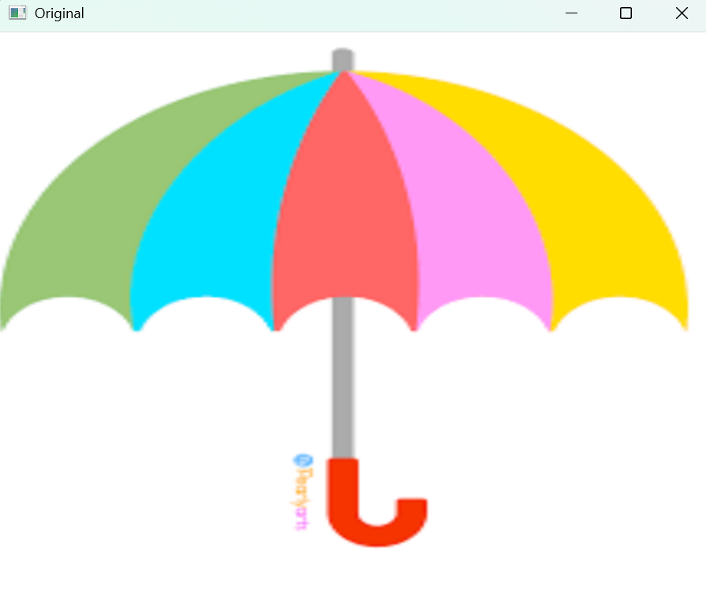
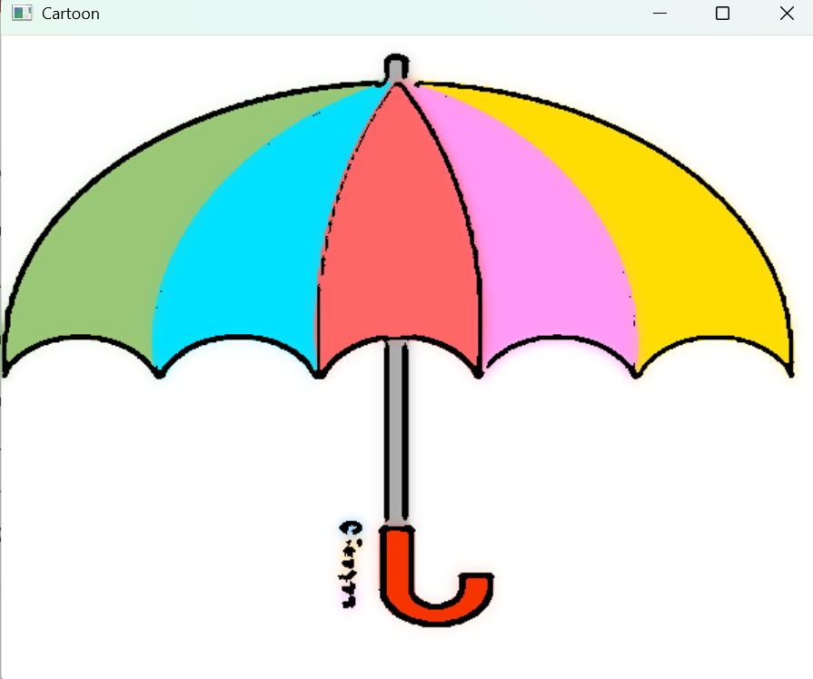

## Cartoon Image Filter using OpenCV

This project converts normal images into cartoon-style images using OpenCV image processing techniques such as bilateral smoothing, edge detection, and color quantization.


---

## Project Structure

```
opencv_buildclub/
├── assets/              # Input images
│   ├── sample.png
├── results/             # Output generated images
│   ├── cartoon_output.png
├── screenshots/         # Proof of results for README
│   ├── original.png
│   ├── cartoon.png
├── src/
│   ├── main.py          # Main program entry
│   ├── utils.py         # Cartoon filter function
├── requirements.txt
└── README.md
```


---

## Features Implemented

   - Image loading & processing
   - Cartoon filter using OpenCV
   - Edge detection + color smoothing
   - Results saved automatically in results/
   - Clean & modular folder structure


---

## Approach Summary

   - Load image from assets/.
   - Convert to grayscale → apply median blur.
   - Detect edges with adaptive thresholding.
   - Apply bilateral filter multiple times for smooth cartoon color.
   - Merge color + edges → final cartoon effect.
   - Save result to results/cartoon_output.png 


---

## Requirements

This project uses:

- Python 3.8+
- OpenCV
- NumPy

Install dependencies:

   ```bash
   pip install -r requirements.txt
   ```


---

## Run the Project

   ```bash
   python src/main.py
   ```


After running:

   - Original image will display first
   - Cartoon image saved inside results/


---

## Screenshots

| Original | Cartoon |
|---------|---------|
|  |  |
'''


---

## Conclusion

This project successfully demonstrates real-time image transformation using OpenCV.
The cartoon filter smoothens regions, sharpens boundaries, and produces visually stylized output.
It can be further extended into video cartoonization, camera live filter, or adding additional effects.

---
